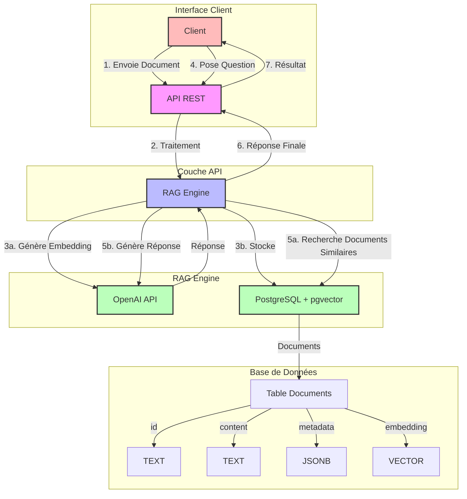

### Explication du Flux

1. **Ajout de Document**
   - Le client envoie un document via l'API REST
   - Le RAG Engine génère un embedding via OpenAI
   - Le document et son embedding sont stockés dans PostgreSQL

2. **Requête**
   - Le client pose une question
   - Le RAG Engine recherche les documents pertinents via pgvector
   - Les documents trouvés sont utilisés avec OpenAI pour générer une réponse
   - La réponse est renvoyée au client

### Composants Clés

- **API REST**: Point d'entrée pour les clients
- **RAG Engine**: Cœur du système, gère la logique métier
- **PostgreSQL + pgvector**: Stockage et recherche vectorielle
- **OpenAI API**: Génération d'embeddings et de réponses
